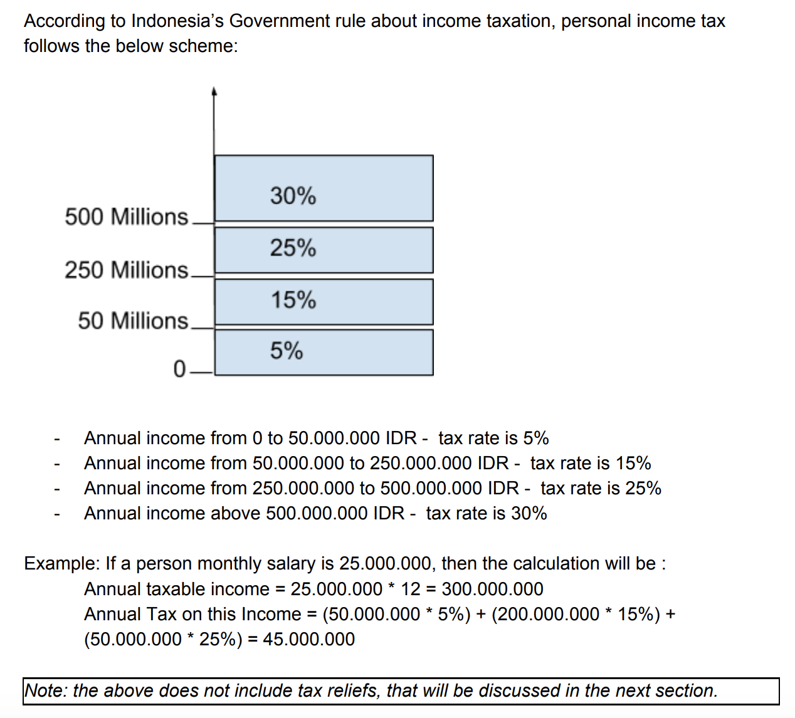
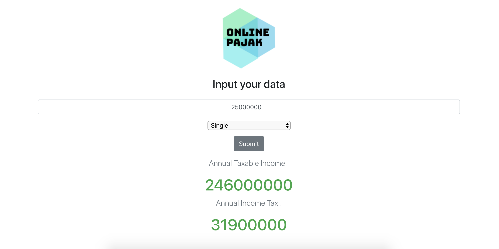

# AAS Developer Hiring Test using Javascript (by Hendri Agustino)

This project is a coding test / developer test which I did for the AAS. I am required to create a program that calculates the Personal Income Tax in Indonesia based on the taxpayer’s annual income and tax reliefs.

**Project Scope** :
## Taxation Scheme

## Taxation Relief

# Snapshots of Web App 
## Main page of Online Pajak web app

# Installation Instructions
## REQUIREMENTS

For development, you will need to install `Node.js` on your environment.

#### Node installation on OS X

1. Open the Terminal App and type brew install node.
2. Wait while Homebrew helps you download and install all the needed files for you to use.

After installing, you can check whether Node.js has been installed by typing `node-v` in terminal. Also to see if NPM is installed already, by typing `npm -v`

#### Node installation on Linux

On terminal, type in : 
`sudo apt-get install nodejs`

#### Node installation on Windows 

Go to [https://nodejs.org/en/download/](https://nodejs.org/en/download/) and follow all the steps to download.

## INSTALL

`$ git clone git@github.com:hendriagustino/aas-frontend-test.git` 
`$ cd aas-frontend-test` 
`$ npm install`

# START 

`$ npm start`
